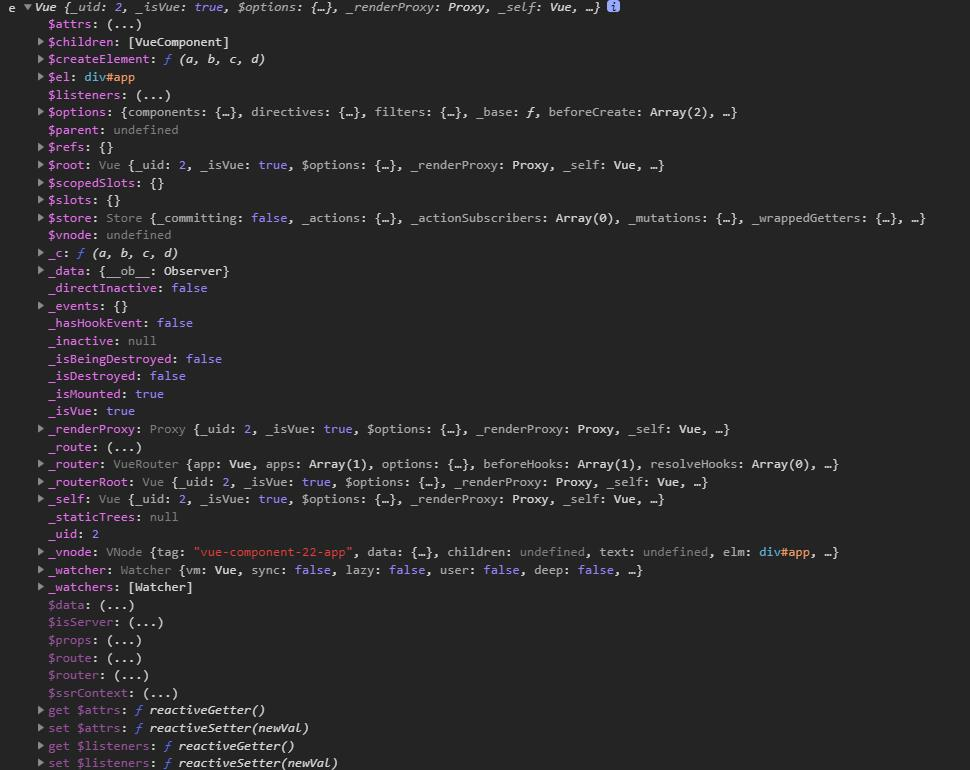

# 源码阅读

## 1.找到入口

首先通过`package.json`了解其依赖和其`script`命令
找到一个打包命令`"build": "node scripts/build.js",`
然后去看`script/build.js`
....
最后找到 `rollup`打包入口

```js
 // Runtime only ES modules build (for bundlers)
'web-runtime-esm': {
    entry: resolve('web/entry-runtime.js'),
    dest: resolve('dist/vue.runtime.esm.js'),
    format: 'es',
    banner
  },
```

## 2.从入口解读

- `src/platforms/web/entry-runtime.js`

```js
import Vue from './runtime/index'
export default Vue
```

- `src/platforms/web/entry-runtime.js`

```js
import Vue from 'core/index'
// ...
// 下面代码 对原型上的方法进行了挂载，此时先忽略，整理出主线
```

- `src/core/index.js`

```js
import Vue from './instance/index'
import {initGlobalAPI} from './global-api/index'
initGlobalAPI(Vue) // 初始化全局API
// ... 挂载
export default Vue
```

- `src/core/instance/index.js`  
  先声明 VUE 构造函数，然后值传递，在其他函数内部中挂载方法

```js
import {initMixin} from './init'
import {stateMixin} from './state'
import {renderMixin} from './render'
import {eventsMixin} from './events'
import {lifecycleMixin} from './lifecycle'
import {warn} from '../util/index'

function Vue(options) {
  this._init(options)
}

initMixin(Vue)
stateMixin(Vue)
eventsMixin(Vue)
lifecycleMixin(Vue)
renderMixin(Vue)

export default Vue
```

## 3.`initMixin`

挂载一个 `_init`方法

- 'src/core/instance/index.js

```js
export function initMixin(Vue: Class<Component>) {
  Vue.prototype._init = function(options?: Object) {
    const vm: Component = this
    // a uid
    vm._uid = uid++

    let startTag, endTag
    /* istanbul ignore if */
    if (process.env.NODE_ENV !== 'production' && config.performance && mark) {
      startTag = `vue-perf-start:${vm._uid}`
      endTag = `vue-perf-end:${vm._uid}`
      mark(startTag)
    }

    // 一个用来避免被观察的标志
    vm._isVue = true
    // 合并选项
    if (options && options._isComponent) {
      // 优化内部组件实例化
      // 因为动态选项合并非常慢，而且没有
      // 内部组件选项需要特殊处理
      initInternalComponent(vm, options)
    } else {
      vm.$options = mergeOptions(
        resolveConstructorOptions(vm.constructor),
        options || {},
        vm
      )
    }
    /* istanbul ignore else */
    if (process.env.NODE_ENV !== 'production') {
      initProxy(vm)
    } else {
      vm._renderProxy = vm
    }
    // expose real self
    vm._self = vm
    initLifecycle(vm)
    initEvents(vm)
    initRender(vm)
    callHook(vm, 'beforeCreate')
    initInjections(vm) // resolve injections before data/props
    initState(vm)
    initProvide(vm) // resolve provide after data/props
    callHook(vm, 'created')

    /* istanbul ignore if */
    if (process.env.NODE_ENV !== 'production' && config.performance && mark) {
      vm._name = formatComponentName(vm, false)
      mark(endTag)
      measure(`vue ${vm._name} init`, startTag, endTag)
    }

    if (vm.$options.el) {
      // 挂载方法
      vm.$mount(vm.$options.el)
    }
  }
}
```

## 4. new Vue

首先传入一个 对象 `{ el: '#app', router, store, template: '<App/>', components: { App } }`

### VUE 根实例



### VUE Compoent 实例

隐式原型指向 VUE 实例


...
初步目标

## 响应式数据

1. `Dep` 发布订阅

```js
export default class Dep {
  static target: ?Watcher
  id: number
  subs: Array<Watcher>

  constructor() {
    this.id = uid++
    this.subs = []
  }

  addSub(sub: Watcher) {
    this.subs.push(sub)
  }

  removeSub(sub: Watcher) {
    remove(this.subs, sub)
  }

  depend() {
    if (Dep.target) {
      Dep.target.addDep(this)
    }
  }

  notify() {
    // stabilize the subscriber list first
    const subs = this.subs.slice()
    if (process.env.NODE_ENV !== 'production' && !config.async) {
      // subs aren't sorted in scheduler if not running async
      // we need to sort them now to make sure they fire in correct
      // order
      subs.sort((a, b) => a.id - b.id)
    }
    for (let i = 0, l = subs.length; i < l; i++) {
      subs[i].update()
    }
  }
}
```

2. `def` 定义数据 / 冻结数据

```js
/**
 * Define a property.
 */
export function def(obj: Object, key: string, val: any, enumerable?: boolean) {
  Object.defineProperty(obj, key, {
    value: val, // 值
    enumerable: !!enumerable, // 是否枚举
    writable: true, // 可写,默认是false
    configurable: true, //  属性描述符能够被改变，同时该属性也能从对应的对象上被删除。默认为 false。
  })
}
```

3. `Observer` 类

```js
/**
 * 附加到每个被观察对象的观察者类
 * 对象。一旦附加，观察者将转换目标
 * 对象的属性键转换为getter/setter
 * 收集依赖项并分派更新。
 */
export class Observer {
  value: any
  dep: Dep
  vmCount: number // 将此对象作为根$data的vm数量

  constructor(value: any) {
    this.value = value
    this.dep = new Dep()
    this.vmCount = 0
    // object.defineproperty(value,'__ob__',this)
    def(value, '__ob__', this)
    if (Array.isArray(value)) {
      // 数组处理
      if (hasProto) {
        // '__proto__' in {}
        // value.__proto__ = arrayMethods 修改隐士原型
        protoAugment(value, arrayMethods)
      } else {
        // def(value, arrayMethods, ...arrayKeys) // 给数据keys 统一加一个订阅
        copyAugment(value, arrayMethods, arrayKeys)
      }
      // observe(items[i])
      this.observeArray(value)
    } else {
      // 对象的处理
      this.walk(value)
      // const keys = Object.keys(value)
      // defineReactive(obj, ...keys)
    }
  }

  /**
   * Walk through all properties and convert them into
   * getter/setters. This method should only be called when
   * value type is Object.
   */
  walk(obj: Object) {
    const keys = Object.keys(obj)
    for (let i = 0; i < keys.length; i++) {
      defineReactive(obj, keys[i])
    }
  }

  /**
   * Observe a list of Array items.
   */
  observeArray(items: Array<any>) {
    for (let i = 0, l = items.length; i < l; i++) {
      observe(items[i])
    }
  }
}
```


4. `ovserve` 创建一个观察者实例

```js


/**
 * 尝试为值创建一个观察者实例，
 * 如果成功观察到，返回新的观察者，
 * 或现有的观察者，如果值已经有一个。
 * value 观察者源 是否根节点  返回 ovserver 或 void
 */
export function observe (value: any, asRootData: ?boolean): Observer | void {
  // 如果不是对象或者 源 是 vnode 则直接返回
  if (!isObject(value) || value instanceof VNode) return
  let ob: Observer | void
  // 如果存在于响应式 对象 则直接赋值
  if (hasOwn(value, '__ob__') && value.__ob__ instanceof Observer) {
    ob = value.__ob__
  } else if (
    // 需要更新 && 非服务端渲染 
    // 数组 或者 浅层对象
    // 对象是否是可拓展
    shouldObserve && !isServerRendering() &&
    (Array.isArray(value) || isPlainObject(value)) &&
    Object.isExtensible(value) &&
    !value._isVue
  ) {
    ob = new Observer(value)
  }
  if (asRootData && ob) {
    ob.vmCount++
  }
  return ob
}
```


5. `defineReactive` 在对象上定义响应性属性
```js
/**
 * Define a reactive property on an Object.
 * 在对象上定义反应性属性。
 * // obj key  value 自定义设置函数 是否浅层对象
 */
export function defineReactive (
  obj: Object,
  key: string,
  val: any,
  customSetter?: ?Function,
  shallow?: boolean
) {
  const dep = new Dep()
  /***
   * Object.getOwnPropertyDescriptor() 
   * 返回对象上一个自有属性对应的属性描述符。
   *（自有属性指的是直接赋予该对象的属性，不需要从原型链上进行查找的属性）
   */
  const property = Object.getOwnPropertyDescriptor(obj, key)
  if (property && property.configurable === false) {
    return
    // 如果不能被改变，直接 void
  }

  // cater for pre-defined getter/setters
  // 满足预定义的getter/setter
  const getter = property && property.get
  const setter = property && property.set
  // 如果没有给val 返回 原 val
  if ((!getter || setter) && arguments.length === 2) {
    val = obj[key]
  }

  // 是否是 非浅层 且直接 创建一个响应式 对象
  let childOb = !shallow && observe(val)
  Object.defineProperty(obj, key, {
    enumerable: true,
    configurable: true,
    get: function reactiveGetter () {
      const value = getter ? getter.call(obj) : val
      if (Dep.target) {
        // 如果有 watch 触发watch 
        dep.depend()
        if (childOb) { // 如果是深层级，给 深层级的对象也触发 发布
          childOb.dep.depend()
          if (Array.isArray(value)) {
            // 数组递归触发 发布
            dependArray(value)
          }
        }
      }
      return value
    },
    set: function reactiveSetter (newVal) {
      // 原值
      const value = getter ? getter.call(obj) : val
      /* eslint-disable no-self-compare */
      // 值不变 不做变更
      if (newVal === value || (newVal !== newVal && value !== value)) {
        return
      }
      /* eslint-enable no-self-compare */
      if (process.env.NODE_ENV !== 'production' && customSetter) {
        customSetter()
      }
      // #7981: for accessor properties without setter
      if (getter && !setter) return
      if (setter) {
        setter.call(obj, newVal)
      } else {
        val = newVal
      }
      // 如果是深层级 ，再做一下响应式处理，如果有原响应对象，则 VMCount ++ 
      childOb = !shallow && observe(newVal)
      dep.notify() // 给订阅者 发布
    }
  })
}
```

## VDOM
